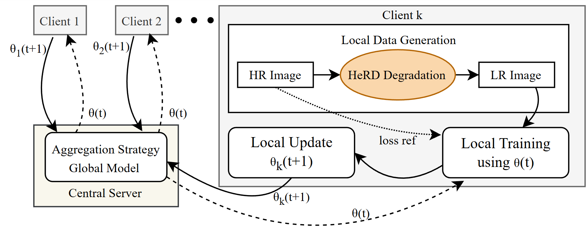

# HeRD: Modelling Heterogeneous Degradations for Federated Super-Resolution in Satellite Imagery

This repository contains the official source code and implementation for the paper ["HeRD: Modelling Heterogeneous Degradations for Federated Super-Resolution in Satellite Imagery"](https://ieeexplore.ieee.org/document/11083581).

### Abstract
Federated learning (FL) offers a privacy-preserving solution for single-image super-resolution (SR) on sensitive satellite imagery, but its performance is often hindered by simplistic data models. Existing methods that rely on simple bicubic downsampling fail to capture the complex, client-specific degradations found in real-world satellite data, creating a significant domain gap. To address this, we propose a novel strategy, Heterogeneous Realistic Degradation (HeRD), which models data heterogeneity by generating realistic low-resolution images based on the unique, device-locked characteristics of different satellites. Unlike conventional approaches, HeRD systematically applies diverse, anisotropic degradations to enable fine-grained control over non-Independent and Identically Distributed (non-IID) conditions. Our extensive evaluations demonstrate the robustness of FL when trained with HeRD. The proposed federated pipeline outperforms traditional bicubic-based setups by over 0.5 dB in PSNR. Notably, even in highly heterogeneous environments, our approach achieves performance within just 0.2-0.4 dB of a fully centralized training model. These findings confirm that HeRD provides a viable, high-performance, and privacy-preserving alternative for super-resolving distributed satellite imagery where data sovereignty and disparate hardware characteristics are paramount.



### Repository Structure
```
.
├── data/                    # Scripts and classes for dataset handling
├── datasets/                # Root directory for all datasets
│   └── AID_HR_images/       # User needs to create this for raw images
│       ├── train/
│       ├── validation/
│       └── test/
├── experiments/             # Output directory for logs, models, and tensorboard files
├── flower/                  # Flower framework client and strategy implementations
├── models/                  # Model architectures (RRDBNet, SwinIR, etc.)
├── scripts/                 # Training and testing logic
├── utils/                   # Utility functions for IQA, image processing, etc.
├── centralized_training.py  # Script for centralized training baseline
├── federated_training.py    # Main script for federated training
├── generate_herd_data.py    # Script to generate datasets using the HeRD strategy
├── test_best_model.py       # Script to evaluate a trained model
└── environment.yml          # Conda environment file
```

## 1. Environment Setup

This project uses Conda to manage dependencies.

1.  **Prerequisites**: Ensure you have Anaconda or Miniconda installed.

2.  **Create Conda Environment**: Create the environment from the `environment.yml` file. This will install all necessary dependencies, including PyTorch, Flower, and OpenCV.
    ```bash
    conda env create -f environment.yml
    ```

3.  **Activate Environment**: Activate the newly created environment.
    ```bash
    conda activate ptfl_basicsr
    ```

## 2. Dataset Preparation (The HeRD Strategy)

Our HeRD strategy generates realistic, client-specific degradations to simulate non-IID "physics skew" found in real-world satellite deployments. The process involves applying anisotropic Gaussian blur and additive white Gaussian noise, with degradation ranges assigned to each client via a Dirichlet distribution.

Follow these steps to generate the required datasets:

1.  **Place Raw Images**:
    * Create the following directory structure: `datasets/AID_HR_images/`.
    * Inside, create three subfolders: `train`, `validation`, and `test`.
    * Place your original high-resolution AID (or other) satellite images into these respective folders.

2.  **Configure Degradation Parameters**:
    * Open the `generate_herd_data.py` script.
    * Modify the global parameters at the top of the file to match your desired experiment setup. These are the key parameters for reproducing the results from the paper:
        * `num_clients`: The number of clients in the federated setup (e.g., 5 for AID experiments, 10 for SIMD).
        * `alpha`: The Dirichlet distribution parameter that controls heterogeneity (e.g., 0.1 for high, 0.5 for moderate, 1.0 for mild).
        * `dataset_dir`: Path to the raw HR training images (e.g., `'datasets/AID_HR_images/train'`).
        * `validation_hr_dir` and `test_hr_dir`: Paths to the raw HR validation and test images.

3.  **Run the Generation Script**:
    Execute the script to generate the degraded datasets for all clients, including the federated validation and test sets.
    ```bash
    python generate_herd_data.py
    ```
    This will create a new timestamped directory in `datasets/` containing the client-separated data (`client_0`, `client_1`, etc.), the global `federated_validation` and `test` sets, and a `dataset_info.log` file detailing the specific degradation ranges for each client.

## 3. Training

The repository supports both federated and centralized training.

### Federated Training (HeRD)

1.  **Configure Training Script**:
    * Open the `federated_training.py` script.
    * Update the following paths and parameters:
        * `main_dir`: Set this to the `client_data` directory created by `generate_herd_data.py`. For example: `'datasets/20250116-1049.../client_data'`.
        * `HR_path_val` and `LR_path_val`: Point these to the `HR` and `LR_both` (or other variant) folders inside the `federated_validation` directory generated by the previous step.
        * `NUM_CLIENTS`: Ensure this matches the `num_clients` used during data generation.
        * `strategy`: Choose between `FedAvg` and `FedProx` by modifying the `SaveModelStrategy` and setting the `proximal_mu` value. For FedAvg, you can comment out `proximal_mu`.
        * `expermient_details`: Change this string to give your experiment a unique, descriptive name.

2.  **Run Federated Training**:
    ```bash
    python federated_training.py
    ```
    The training progress will be logged, and the best-performing global model (`best_model.pth`), the latest model (`latest_model.pth`), and TensorBoard logs will be saved in a new timestamped directory inside `experiments/`.

### Centralized Training (Baseline)

For comparison, you can train a model on all data centrally, which serves as a performance upper bound.

1.  **Configure Training Script**:
    * Open `centralized_training.py`.
    * Update the paths and parameters similarly to the federated script, ensuring `main_dir` points to the correct `client_data` directory.

2.  **Run Centralized Training**:
    ```bash
    python centralized_training.py
    ```
    Results and models will be saved in a new directory under `experiments/`.

## 4. Evaluation

To evaluate a trained model on the test set:

1.  **Configure Test Script**:
    * Open `test_best_model.py`.
    * Modify the following variables:
        * `HR_path_test`: Path to the high-resolution test images (e.g., `datasets/AID_SR_for_degradation_splits_large_val_test/test/HR`).
        * `LR_path_test`: Path to the corresponding low-resolution test images generated by HeRD (e.g., `datasets/20250124.../test/LR_both`).
        * `model_path`: The full path to the saved model you want to evaluate (e.g., `experiments/run_20250122.../best_model.pth`).

2.  **Run Evaluation**:
    ```bash
    python test_best_model.py
    ```
    The script will print the final PSNR and SSIM values and save them to a log file in the `test_logs/` directory.

## How to Reproduce Results

Here is a complete workflow to reproduce the results for the **AID dataset with high heterogeneity (α=0.1)**, as shown in Table 2 of the paper.

1.  **Prepare Dataset**:
    * Place your AID images in `datasets/AID_HR_images/`.
    * In `generate_herd_data.py`, set:
        * `num_clients = 5`
        * `alpha = 0.1`
    * Run `python generate_herd_data.py`. Note the name of the output directory it creates.

2.  **Train the Federated Model**:
    * In `federated_training.py`, set:
        * `main_dir` to the path of the `client_data` folder you just generated.
        * `LR_path_val` to the `federated_validation/LR_both` folder inside the same generated directory.
        * `NUM_CLIENTS = 5`
        * `strategy = SaveModelStrategy(...)` with the desired algorithm (e.g., `proximal_mu=1.0` for FedProx).
    * Run `python federated_training.py`. Note the name of the experiment directory created in `experiments/`.

3.  **Evaluate the Final Model**:
    * In `test_best_model.py`, set:
        * `model_path` to `experiments/YOUR_EXPERIMENT_RUN/best_model.pth`.
        * `LR_path_test` to the `test/LR_both` folder from your generated dataset.
    * Run `python test_best_model.py` to obtain the final PSNR/SSIM scores.

## Citation

If you find this work useful for your research, please consider citing our paper:

```bibtex
@ARTICLE{11083581,
  author={Khan, Bostan and Mousavi, Seyedhamidreza and Daneshtalab, Masoud},
  journal={IEEE Access}, 
  title={HeRD: Modeling Heterogeneous Degradations for Federated Super-Resolution in Satellite Imagery}, 
  year={2025},
  volume={13},
  number={},
  pages={125857-125868},
  keywords={Degradation;Satellite images;Satellites;Remote sensing;Training;Federated learning;Data models;Anisotropic;Superresolution;Adaptation models;Federated learning;super-resolution;remote sensing;privacy-preserving;heterogeneous data;satellite imagery},
  doi={10.1109/ACCESS.2025.3590171}}
```

For more information please contact the authors on their respective emails, thank you.

## Acknowledgements

We'd like to acknowledge the invaluable support from the following organizations and projects:

* **National Academic Infrastructure for Supercomputing in Sweden (NAISS)**: This work was supported by NAISS through the Swedish Research Council (Grant Number: 2022-06725).
* **European Union and Estonian Research Council**: Support was provided via Project TEM-TA138.
* **Swedish Innovation Agency VINNOVA**: This research was supported by the Fully Autonomous Safety and Time-critical Embedded Realization of Artificial Intelligence (FASTER-AI) project.